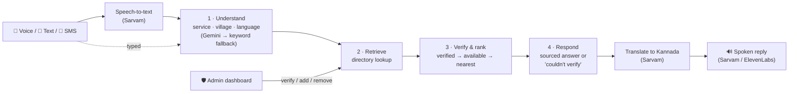

<div align="center">

# GramSetu

### *Setu* means bridge — between a villager with a need and someone verified who can meet it.

**Ask in your own words, in Kannada or English — by voice, text or SMS — and get one verified, local, actionable answer. Or an honest "I couldn't verify" — never a guess.**

[](https://gramsetu-delta.vercel.app)


**PS-02 "GramConnect" · Track 04 Rural Innovation · Innovators Conclave 2026 (24-hour build)**

</div>

---

## 🔗 Try it live — no setup, no login

| | Link | What you'll see |
|---|---|---|
| 🏠 **Home** | **https://gramsetu-delta.vercel.app** | The pitch, plus a live "press and hold to ask" voice orb wired to the real pipeline |
| 🎤 **Voice + chat demo** | **https://gramsetu-delta.vercel.app/demo** | Speak or type a request in Kannada or English, get a verified answer read back aloud |
| 💬 **SMS view** | **https://gramsetu-delta.vercel.app/demo/sms** | The same answers in a phone-style SMS thread — same backend as the real SMS webhook |
| 🛡️ **Admin dashboard** | **https://gramsetu-delta.vercel.app/admin** | The village's trust console — add, verify, mark available, remove (password: ask the team) |

> Use **Chrome or Edge** and allow the microphone. On `/demo`, click **🎤 Speak**, say one sentence, click **⏹ Stop**.

**Try saying:**

| Say | GramSetu answers |
|---|---|
| *"My fan stopped working and the switchboard smells like burning. I am in Hosahalli."* | **Manjunath Electricals** — 2.8 km, available now, ✅ verified by Village Admin *(it worked out "electrician" on its own)* |
| *"Nanna motor pump kelasa maadutilla, Channapatnadalli electrician beku."* | **Suresh Electrical Repairs** — 4 km, ✅ verified — **spoken back in Kannada** |
| *"I need a tailor in Channapatna."* | *"I couldn't verify a tailor near Channapatna… I don't want to guess."* |

---

## 💡 Why we built this

We surveyed 45 residents door-to-door in Nettigere, a village of about 150 houses. The sentence we heard most wasn't about roads or water — it was ***"Yaaru kelbek antha gottilla"*** — *"I don't know who to ask."*

The electrician exists. The office exists. What's broken is that you can't reach them when you need to, and a phone number found on a wall or in a neighbour's memory is often years out of date.

**The gap isn't access. It's trust.** So GramSetu is built around one rule: *the AI understands the question, but the village decides what's true.*

---

## ✨ Features

### 1. 🗣️ Ask the way you'd ask a neighbour — in Kannada or English
- **Real speech-to-text** with **Sarvam AI** (Indic ASR) — auto-detects Kannada vs English, no language menu needed.
- **Understands intent, not keywords** — "the switchboard smells like burning" → electrician; "my tap is leaking" → plumber.
- **Replies are spoken back** in the resident's language — **Sarvam** voice for Kannada, **ElevenLabs** for English.
- Falls back to the browser's built-in speech APIs if the voice services are unreachable.

### 2. ✅ Verified answers — or an honest "I don't know"
- Every answer names **who verified the provider** (e.g. *"verified — source: Village Admin"*), plus distance, availability and a phone number.
- Ranking is deterministic: **verified + available first → then by distance**. Unverified listings come with an explicit warning.
- If nothing verified matches, GramSetu **says so and does not invent a name**. The reply is built only from real directory records, so the AI has nothing to hallucinate with.

### 3. 🛡️ Admin dashboard — the village's trust layer
The Panchayat / village admin controls what GramSetu is allowed to say:
- ➕ **Add** a provider — starts **unverified** until confirmed
- ✅ **Verify / un-verify** with one click
- 🟢 **Mark available / unavailable**
- 🗑️ **Remove** outdated listings

Changes feed straight into the next answer — un-verify a provider and GramSetu stops vouching for them. "Verified" is a live human decision, not a label we hard-coded. *(Until Supabase is connected, the directory lives in server memory, so edits can reset when Vercel restarts a server.)*

### 4. 📱 Works on the phone people already own — SMS
- A real **Twilio SMS webhook** (`/api/sms`) — text in, verified answer out, as standard TwiML.
- `/demo/sms` shows the exact same flow in a phone-style thread.

### 5. 🔁 One pipeline, every channel
Web chat, voice and SMS all call the **same** `runPipeline()` — an answer can't change depending on which door you came in through.

### 6. 🧱 Built not to break on stage
Every external service has a fallback, so the demo keeps answering even when free-tier APIs don't:

| Step | First choice | Fallback | Last resort |
|---|---|---|---|
| Understanding | Claude (if key set) | **Gemini** — 6s cap, skipped for 60s after a full failure | Sarvam translate → keyword + Kannada synonym matching |
| Speech → text | **Sarvam** (saaras:v3) | Browser SpeechRecognition | Type instead |
| Text → speech | **Sarvam** (Kannada) / **ElevenLabs** (English) | Sarvam for English | Browser speechSynthesis |
| Directory | Supabase (Postgres) | In-memory directory | — |

---

## ⚙️ How it works



**Where AI is used — and where it deliberately isn't:**

| Step | What it does | AI? |
|---|---|---|
| **Understand** | Turns *"nanna motor pump kelasa maadutilla"* into `electrician · Channapatna · Kannada` | ✅ LLM + Indic speech/translation |
| **Retrieve** | Finds providers for that service in that village | ❌ plain code |
| **Verify & rank** | Verified by a human admin → available → nearest | ❌ plain code |
| **Respond** | Builds the answer only from directory records | ❌ template, then translated |

AI understands the question. **People decide what's true.**

---

## 🚀 Deployment

- **Production:** **https://gramsetu-delta.vercel.app** on **Vercel**
- **Continuous deployment:** the GitHub repo is connected to Vercel — every push to `main` goes live in about a minute
- **Open to judges:** Vercel's default login-gated deployment protection is turned off for this project, so anyone can open the links above
- **Framework preset** pinned to Next.js in `vercel.json`
- **Secrets** are Vercel environment variables, never committed: Gemini, Sarvam (6 keys rotated on rate limits), ElevenLabs, Twilio and the admin password
- **Admin dashboard** is password-protected in production (`ADMIN_PASSWORD`); the local-dev `demo` password is disabled there

**Verified live in production:** Kannada and English voice round-trip in a real browser (record → transcribe → answer → spoken reply), Gemini intent understanding, Sarvam Kannada translation and speech, SMS webhook responses, admin dashboard login and edits.

---

## 📊 Status — what's real today

| | Status |
|---|---|
| Verified-answer pipeline (understand → retrieve → verify → respond) | ✅ Live |
| Voice in Kannada + English (Sarvam STT/TTS, ElevenLabs, browser fallback) | ✅ Live |
| Kannada replies (Sarvam translation + Kannada voice) | ✅ Live |
| Honest "couldn't verify" — no invented providers | ✅ Live |
| Admin dashboard: add / verify / availability / remove | ✅ Live |
| Web chat demo + SMS-thread view | ✅ Live |
| Homepage with live voice "ask" orb | ✅ Live |
| Twilio SMS webhook | ✅ Built and tested — needs a paid Twilio number to receive real texts |
| Supabase persistent directory | 🟡 Schema and code ready — running on in-memory data until the project URL is added |
| Missed-call callback / IVR, "press 1 to connect" | 🔜 Next |
| Weekly "still available? reply 1" SMS to providers | 🔜 Next |
| Auto-escalation to the Panchayat when nothing is verified | 🔜 Next |
| Real Nettigere directory data | 🔜 Next |

---

## 🧰 Tech stack

| Layer | Tech |
|---|---|
| App | **Next.js** (App Router) · **TypeScript** · **Tailwind** · shadcn/ui · Framer Motion |
| Understanding | **Gemini** (`gemini-flash-latest`), Claude-ready |
| Indic voice & language | **Sarvam AI** — speech-to-text (saaras:v3), translation, Kannada speech (bulbul:v3) |
| English voice | **ElevenLabs** (multilingual v2) |
| SMS | **Twilio** webhook (TwiML) |
| Directory | **Supabase** (Postgres) · in-memory fallback |
| Hosting | **Vercel** — auto-deploy from `main` |

---

## 🖥️ Run it locally

```bash
npm install
npm run dev        # http://localhost:3000
```

Works with **no API keys** — it falls back to keyword understanding, the browser's voice and in-memory data. Copy `.env.example` to `.env.local` and add keys to switch on Gemini, Sarvam, ElevenLabs, Twilio and Supabase. Admin password locally: `ADMIN_PASSWORD`, or `demo` if it isn't set.

```bash
# test the SMS webhook without Twilio
curl -X POST http://localhost:3000/api/sms --data "Body=I need a plumber near Hosahalli"
```

---

## 📁 Project structure

```
app/
  page.tsx                     # homepage + live voice "ask" block
  demo/page.tsx                # voice + chat demo
  demo/sms/page.tsx            # SMS-thread view
  admin/page.tsx               # admin dashboard (trust layer)
  api/query/route.ts           # shared pipeline endpoint
  api/sms/route.ts             # Twilio SMS webhook
  api/voice/transcribe/route.ts  # Sarvam speech-to-text
  api/voice/speak/route.ts       # Sarvam (Kannada) / ElevenLabs (English) speech
  api/admin/listings/route.ts    # directory CRUD
lib/
  pipeline/                    # understand · retrieve · respond · index (runPipeline)
  hooks/use-voice-conversation.ts  # one voice loop for every web page
  clients/                     # sarvam · elevenlabs · supabase
  data/                        # demo directory, village aliases, synonyms
components/marketing/          # homepage sections, hold-to-talk, voice orb
supabase/                      # schema.sql · seed.sql
docs/                          # problem statement · concept
```

---

## 🤝 Responsible AI

- **Demo data is fictional.** The providers (e.g. "Ravi Plumbing Works") and villages in the directory are sample data for the prototype, not real businesses.
- **Every answer is traceable** to a directory record and names who verified it — the PS-02 requirement: *"Every answer should be traceable to a verified source, and the system must say so when it does not know."*
- **No guessing:** when nothing verified matches, the system says so.
- **GramSetu doesn't store residents' questions or voice clips** — audio is sent to Sarvam for transcription and not saved by our app.

<div align="center">

**GramSetu — a bridge, not a directory.**

</div>
